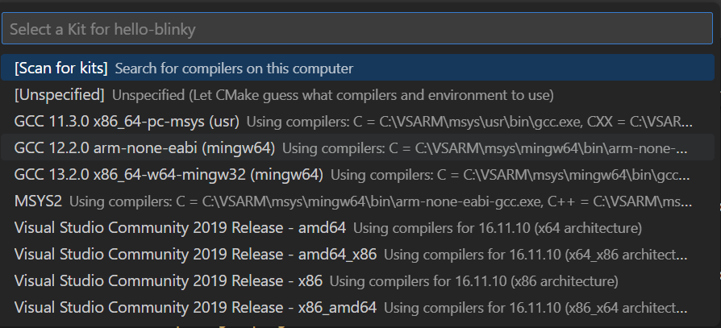
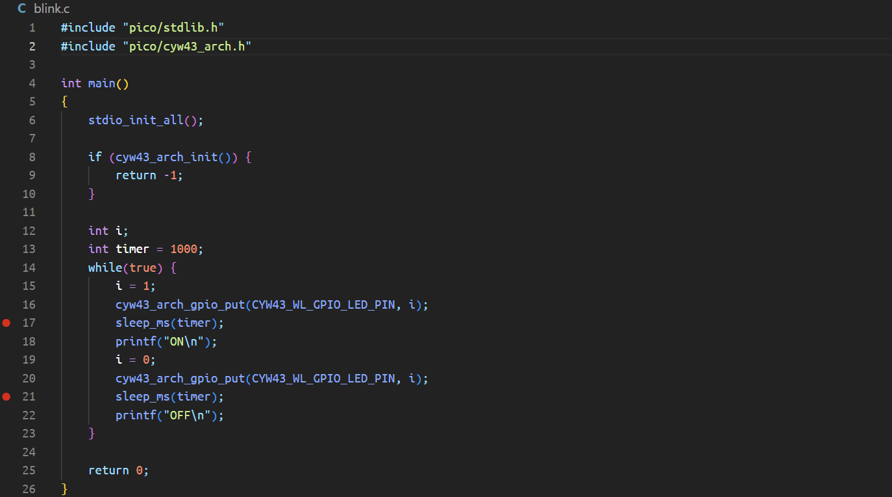

# CMPSC 200: Hello, Blinky

| Date              |          |
|:------------------|:---------|
| 12 September 2023 | Assigned  |
| 19 September 2023 | Due, start of class       |
| Status           |  |

## Learning objectives

* configure a development environment to cross-compile `C` and `Assembly` programs for the ARM architecture
* apply generic stored-program computer principles to a new, physical architecture
* compile and execute a `C`-language program cross-compiled for the ARM device architecture
* debug a basic `Assembly` language program using register values to correct program code

## Introduction

This week, we begin the task of installing the necessary tools for building programs for a specific architecture. While the CARDIAC represents an architecture, it's not the same as getting into a live circuit and silicon chip.

The pre-lab goal of this week is to get the `C` program, `blink.c` to install on your ARM debugging setup. Of course, it's more complicated than that given that you're compiling the program for an ISA which is _not your PC_. But, we can do that with the help of an extensive "toolchain."

## Toolchain and "pinout"

The process of installing a toolchain is OS-specific. To make instructions as freely available as possible, we will use our `course-materials` repository's `Wiki`, located at the following link

* [Course Materials configuration wiki](https://github.com/allegheny-college-cmpsc-200-fall-2023/course-materials/wiki)

Follow the steps for your specific OS to enable your PC to successfully cross-compile to the Raspberry Pi Pico W (the ARM device).

### "Pinout"

The "pinout" (or connection diagram) is the last step before trying your PC configuration. Take care to connect the pins and connectors as illustrated, or you won't get any output!

The instructor will demonstrate and walk-through this step once everyone is caught up with toolchain installs.

## Cross-compiling a program

Once you're ready to build `blinky.c`, head to the [Course Materials configuration wiki](https://github.com/allegheny-college-cmpsc-200-fall-2023/course-materials/wiki), specifically the entry on [Debugging with the picoprobe](https://github.com/allegheny-college-cmpsc-200-fall-2023/course-materials/wiki/02-Debugging-with-the-picoprobe).

### Setting a `CMake` "kit"

By default, when you open a new project, no "kit" is selected. We need to tell `CMake` what cross-compiler to use to generate our binary for the target device. To set up the kit, click the `No Kit Selected` button on the status bar. This should appear after you install the `CMake Tools` extension in `VSCode`.

The command palette will appear with a list of appropriate compilers. If your configuration is correct, one of them should be a variant of `arm-gcc-eabi-none`. Choose that compiler.

If all is successful, you should get a blinking Pico!

## Debugging a bit

In `blink.c`, set "breakpoints" at lines `17` and `21`. To do so:

* hover in the margin to the left of the lines in the `VSCode` code editor
  * a small red circle should appear
* click the semi-opaque red circle to set a breakpoint
  * the circle will turn an opaque red

Your program window should look like the picture below:

* run the debug again, and notice the `Debug` window's behavior
  * what can you see?
  * how does the information change?
